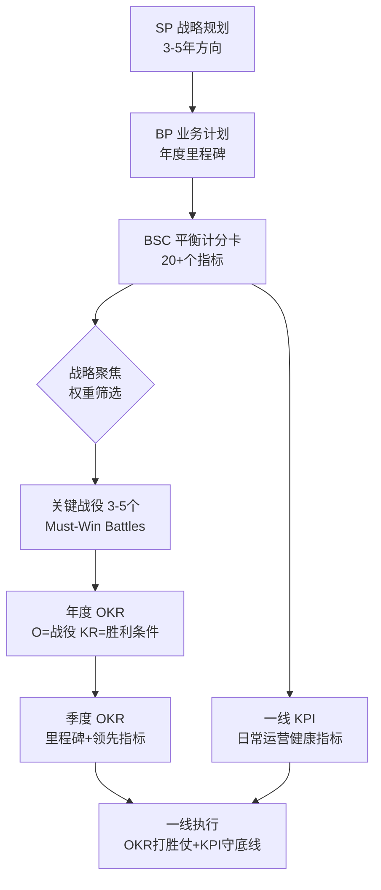

# 战略解码核心能力：BSC 到 OKR 的无损穿透

> **核心哲学（红队思维）**：**战略的默认结果是失败**。本 Skill 不负责鼓舞士气，只负责**“事前验尸” (Pre-mortem)**。我们将以**极度悲观**的保守主义视角，基于扎实的管理学理论（BSC/OKR/GSC），使用手术刀般的犀利追问，毫不留情地切开组织内部的每一处逻辑断层、资源虚报和能力谎言。**只有挺过这种地狱级校验的战略，才有活下来的资格。**

## ⚠️ 检验者立场：残酷的“魔鬼代言人”

在使用本 Skill 进行战略校验时，必须切换至以下人格：

1.  **极度悲观 (Radical Pessimism)**：
    *   *假设*：所有没被锁定的预算都会被挪用；所有没到位的 HC 都会招不到；所有依赖兄弟部门的协同都会被鸽。
    *   *准则*：不要听“我们在努力”，只看“协议已签署”。
2.  **寻找不自洽 (Inconsistency Hunter)**：
    *   *雷达*：敏锐捕捉“目标宏大”与“动作保守”之间的裂痕。
    *   *动作*：当发现 CEO 喊着“AI 转型”但还在考核“人工课时量”时，直接亮红牌。
3.  **零容忍 (Zero Tolerance)**：
    *   *态度*：对于逻辑不通的 OKR，直接打回重写，不给面子。掩盖问题是对公司最大的犯罪。

## 零、 战略全景：从规划到落地的完整链条

在深入 BSC 到 OKR 的转化前，必须厘清战略工具的生态位。

### 核心定义
1.  **SP (想)**：3-5年战略规划，定方向。
2.  **BP (定)**：年度经营计划，定预算。
3.  **BSC (衡)**：全面体检报告，20-30 个指标覆盖财务/客户/流程/成长。
4.  **关键战役 (聚)**：**BSC 指标 ≠ OKR**。必须从 BSC 中提炼 3-5 个“必须打赢的仗”作为战略聚焦。
5.  **OKR (做)**：**战役的执行框架**。年度 O 对应战役，KR 对应胜利条件。
6.  **KPI (守)**：**日常运营的安全带**。承接 BSC 中未被选为战役但必须健康的指标。

---

## 一、 顶层设计：从 BSC 到“必须打赢的战役” (Phase I)

平衡计分卡 (BSC) 提供了财务、客户、内部流程、学习成长四个维度的宏观指标，但直接分解容易导致“指标堆砌”。**关键步骤是提炼“必须打赢的战役” (Must-Win Battles, MWBs)。**

### 1.1 战略聚焦矩阵 (Strategic Focus Matrix)
不要试图平衡所有指标。使用以下逻辑筛选年度 3-5 个关键战役：
*   **高权重筛选**：在 BSC 的 20+ 个指标中，找出权重总和占比 >60% 的 3-5 个核心动因。
*   **关键战役定义**：将这些核心动因封装为具体的“商业行动”。
    *   *错误示例*：提升客户满意度 (这是指标，不是战役)
    *   *正确示例*：**“全渠道服务体验重构”战役** (指向了具体的动作域)

### 1.2 校验标准 (Checklist)
*   **资源集中度校验**：这 3-5 场战役是否占据了公司 >70% 的战略预算和高管时间？
*   **因果闭环校验**：如果这几场战役全胜，BSC 的财务维度目标是否**必然**达成？（若仅是“可能”，则战役定义不够犀利）

---

## 二、 骨架构建：从战役到 OKR (Phase II)

将“战役”拆解为可度量的 Objective (O) 和 Key Results (KR)。

### 2.1 年度 OKR：战役的“终局画像”
*   **Objective (O)**：直接对应“关键战役”的名称。
*   **Key Results (KR)**：对应战役胜利的**滞后性指标** (Lagging Indicators)。
    *   *示例*：
        *   O: 赢得“AI Native 转型”战役
        *   KR1: 核心产品 AI 功能渗透率达到 40% (直接承接 BSC 客户维度)
        *   KR2: 研发人效提升 50% (直接承接 BSC 内部流程维度)

### 2.2 季度 OKR：战役的“行军路标”
*   **差异化逻辑**：年度 OKR 只要“结果”，季度 OKR 必须包含“里程碑”和“领先性指标” (Leading Indicators)。
*   **O 的承接**：季度 O 是年度 O 的阶段性拆解（如：Q1 完成基建，Q2 完成迁移）。
*   **KR 的转化**：
    *   年度 KR (渗透率 40%) -> 季度 KR (完成 3 个核心场景的 AI 化上线，且用户试用率 >15%)。

---

## 三、 落地生根：OKR 与一线 KPI 的握手 (Phase III)

解决“高层谈战略，基层盯工分”的割裂。

### 3.1 双轨制管理 (Dual Track)
一线员工通常需要同时背负 KPI 和 OKR，两者不可混淆：
*   **KPI (守底线)**：负责**“维持日常运营 (Run the Business)”**。承接 BSC 中那些未被选为“关键战役”但必须维持健康的指标（如：系统稳定性 99.9%、客户投诉处理及时率）。
    *   *定位*：安全带。不达标要罚，达标是本分。
*   **OKR (打胜仗)**：负责**“变革与增长 (Change the Business)”**。直接承接“关键战役”的拆解任务。
    *   *定位*：发动机。做到了重奖，做不到复盘。

### 3.2 匹配度校验模型
*   **关联度测试**：一线员工的绩效考核中，是否至少有 **20%-30%** 的权重是直接关联 OKR 用以支持“关键战役”的？
    *   *若 < 10%*：说明战略在基层悬空，大家都在“忙着赶路（KPI）”，没人“抬头看天（战略）”。
*   **资源冲突检测**：当 KPI (如：接听量) 与 OKR (如：服务流程改造) 发生时间冲突时，是否有明确的“熔断机制”或“优先级准则”？

---
 
## 四、 战略落地的 5 维校验法 (90% 成功率保障)

在每个季度初，使用以下 5 个维度对“BSC-OKR-KPI”链条进行压力测试。只有 5 项全过，战略落地成功率才能突破 90%。

### 维度 1：纵向因果性 (Vertical Logic)
*   **提问**：如果一线完成了 KPI/OKR，部门的 Key Results 是否**必然**提升？部门 KR 达成，公司的关键战役是否**必然**胜利？
*   **避坑**：警惕“代偿性指标”。例如，一线拼命做“拜访量”（KPI），但没有任何转化率（OKR），导致公司“销售额”（BSC）依然挂零。

### 维度 2：横向协同性 (Horizontal Handshake)
*   **提问**：我的 OKR 依赖兄弟部门的支持，他们的 OKR 里是否有对应的内容？
*   **操作**：建立**“协同握手会”**。
    *   *场景*：产品部 O 是“上线新功能”，研发部若没有对应的“支持新功能开发”的 O，则该战略必死。所有“依赖项”必须在季度初“互认”。

### 维度 3：资源饱和度 (Resource Sufficiency)
*   **提问**：为达成这个野心勃勃的 OKR，预算、HC、技术资源是否已**物理到位**？
*   **红线**：严禁“既要马儿跑，又要马儿不吃草”。若资源有缺口，必须当场削减 OKR 目标值，**“目标与资源必须在同一水平线对齐”**。

### 维度 4：指标先导性 (Lead Indicator Validity)
*   **提问**：我们的 KR 里，是否有 50% 以上是**“过程性/先导性”**指标？
*   **逻辑**：如果全是滞后指标（如：年底看收入），发现问题时已无可挽回。季度 OKR 必须包含“上线数、签约意向书数量、测试通过率”等能**预测**结果的过程指标。

### 维度 5：激励一致性 (Incentive Compatibility)
*   **提问**：打赢这场战役（完成高难度 OKR）的人，年底拿到的是否比仅完成 KPI（守摊子）的人多得多？
*   **原则**：如果“做多错多，不做不错”，则无人会为战略冒险。必须设计**“战役专项奖金”**或**“OKR 权重系数”**，确保利益导向与战略导向完全重合。

---

## 五、 什么是“好的 OKR”？核心判断逻辑

在校验完对齐性后，必须校验 OKR 本身的质量。一个平庸的 OKR 指导不出一流的胜仗。

### 5.1 O 的“三感”校验 (The 'Sense' Test)
*   **画面感 (Visual)**：读到 O 时，脑海中是否浮现出我们庆祝胜利的场景？
    *   *❌ 差*：提升产品稳定性。
    *   *✅ 好*：打造“永不宕机”的金融级交易体验。
*   **愤怒感 (Urgency)**：这个 O 是否解决了大家痛恨已久的某个现状？（战略往往源于对现状的不满）
*   **性感 (Inspiring)**：是否能让团队在周五下午 5 点还愿意为之讨论？

### 5.2 KR 的“SO-WHAT” 拷问
对每一个 KR 连续问三个“那又怎样 (So What)？”，直到触达真正的商业价值或用户价值。
*   *初稿*：本周拜访 10 个客户。(动作) -> So what?
*   *二稿*：收集 10 份有效需求。(产出) -> So what?
*   *终稿*：验证 3 个核心痛点并获得用户的付费意向确认。(价值) -> **这就是好的 KR**。

---

## 六、 进阶视角：OKR 与 GSC (单点突破论) 的辩证关系

> 用户经常问：“我们是否需要关注太多指标？GSC (Goal-Score-Circle) 理论强调只需关注一个‘进球’(Goal)，这与 OKR 有何区别？”

### 6.1 此岸与彼岸：理论差异
| 维度 | OKR (目标与关键结果) | GSC (进球/聚焦理论) |
| :--- | :--- | :--- |
| **隐喻** | **“现代战争”** | **“足球射门”** |
| **核心逻辑** | **系统协同**。为了打赢战争，空军(A)、陆军(B)、后勤(C)必须同时达成各自的目标，缺一不可。 | **单点极致**。全场 90 分钟所有人的跑位、传球、配合，最终只为了那个唯一的“进球 (G)”。 |
| **适用场景** | **复杂组织变革**。需要跨部门、多维度的平衡与协作 (如：既要增长，又要体验，还要人效)。 | **初创/危机/冲刺**。资源有限，只能赌一件事 (如：活下去，或搞定这个大客户)。 |
| **风险** | 容易变成“愿望清单”，失焦。 | 容易“为了进球不择手段”，牺牲长期健康 (如：不仅没防守，还把人踢伤了)。 |

### 6.2 互补融合：像 GSC 一样聚焦，用 OKR 来保障
在实战中，建议**“以 GSC 之魂，赋 OKR 之体”**：

1.  **宏观用 GSC (定战役)**：
    *   在制定**公司级**战略时，必须有 GSC 的决绝。问自己：“如果今年只能赢一场仗(G)，是哪一场？”
    *   这就是前文提到的“关键战役 (Must-Win Battle)”。**战役必须少，最好只有一个核心 G**。

2.  **微观用 OKR (解战役)**：
    *   一旦那个唯一的 G (战役) 确定了，要实现它，就需要研发、市场、服务三个部门配合。
    *   这时用 OKR 将这个 G 拆解为 O1, O2, O3，确保为了进这个球，有人在传球，有人在跑位，有人在防守。

**结论**：**GSC 是战略的“矛尖” (Sharpness)，OKR 是组织的“阵型” (Alignment)。没有 GSC 的 OKR 是散光灯，没有 OKR 的 GSC 是鲁莽的赌徒。**

---

## 七、 战略就绪度三维交叉验证 (The Readiness Triangle)

在逻辑通顺（OKR）、指标聚焦（BSC）之后，往往死在“虚假的保障”上。需对**人、钱、将**进行残酷的现实检验。

### 7.1 一号位胜任力交叉 (Leadership Reality Check)
不要默认部门一号位天然胜任新战略。
*   **日历审计 (Calendar Audit)**：检查一号位未来 1 个月的日程表。
    *   *红线*：如果他的 O 是“AI 创新”，但日历里 90% 的时间在开“传统的销售例会”，说明**将帅无心**，战略必败。
*   **认知对齐 (Cognitive Match)**：
    *   *提问*：“如果不做这事，公司会死吗？”
    *   *验证*：只有当一号位能清晰阐述“不做的毁灭性后果”时，才证明他真的懂这场战役。否则他只是在从众。

### 7.2 财务预算“铁锁”验证 (Financial Lock)
*   **战役专款专用 (Budget Fencing)**：
    *   *陷阱*：财务只给一个部门总包 (Pool)，没有切分。
    *   *要求*：关键战役（OKR）必须有独立的预算科目编码。当其他业务告急时，**战役预算是否被法律级锁定（不可挪用）？**
*   **动态注资机制**：
    *   如果是探索性战役 (R&D)，是否允许“按里程碑释放预算”而非“按年度死板通过”？

### 7.3 人力资源“兵棋推演” (Talent War-Gaming)
*   **关键角色空缺率 (Key Role Vacancy)**：
    *   *拷问*：为了打赢这场仗，必须有的前 3 个关键岗位（如：算法架构师、KA 攻坚手），人到位了吗？
    *   *红线*：如果核心岗位空缺，且招聘周期 > 3个月，**必须直接调低 OKR 预期**。不要幻想“一边打仗一边招人”能赢。
*   **能力密度检测 (Capability Density)**：
    *   *盘点*：现有团队是“过去打赢过旧仗的人”，还是“能打赢新仗的人”？
    *   *行动*：如果能力不匹配，HR 是否准备好了“外包专家”或“顾问团”作为即插即用的算力补充？